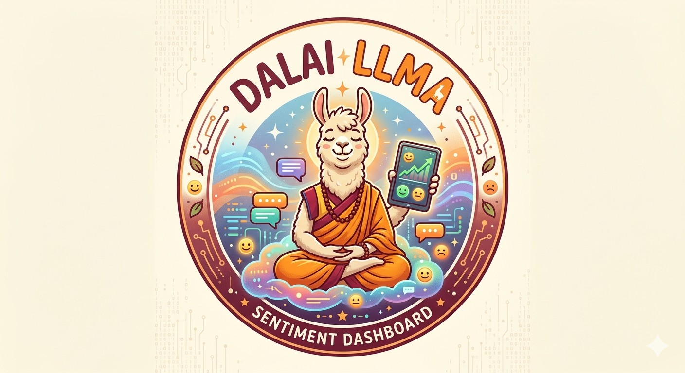

# DalaiLLMA - LLM Conversation Sentiment Dashboard

<p align="center">
  
</p>

A personal analytics dashboard that visualizes sentiment, wellbeing, and patterns from your Claude and ChatGPT conversation history.

## Features

- **Sentiment Tracking**: Monitor emotional tone over time (hopeful vs despair language)
- **Wellbeing Score**: Composite metric combining sentiment, agency, and other indicators
- **Word Clouds**: Visual representation of frequent topics per month
- **People Analysis**: Track who you discuss and associated sentiment
- **Events Timeline**: Significant life events extracted from conversations
- **Drama Triangle**: Karpman triangle analysis (victim/persecutor/rescuer patterns)
- **LLM Insights**: AI-generated deeper analysis using Claude API

## Quick Start

1. **Export your data**
   - Claude: Settings → Export data
   - ChatGPT: Settings → Data controls → Export data

2. **Setup**
   ```bash
   git clone https://github.com/kryptokommunist/dalaillma
   cd dalaillma
   npm install playwright
   
   # Place your exports in ./private_data/llm data/
   mkdir -p "private_data/llm data/anthropic data"
   mkdir -p "private_data/llm data/OpenAI-export"
   # Extract your exports there
   ```

3. **Process data**
   ```bash
   node private_data/process_data.js
   ```

4. **View dashboard**
   ```bash
   npx serve .
   # Open http://localhost:3000/sentiment_dashboard.html
   ```

## Optional: LLM Analysis

For deeper AI-generated insights:

```bash
# Set your API configuration
export ANTHROPIC_BASE_URL="https://api.anthropic.com/"
export ANTHROPIC_AUTH_TOKEN="your-api-key"
export ANTHROPIC_MODEL="claude-3-sonnet-20240229"

# Run analysis (~15 min for full history)
node private_data/llm_analysis.js
```

## Data Privacy

- All processing happens locally
- Personal data stays in `private_data/` (gitignored)
- Never commit conversation exports or insights to public repos

## Preview

The dashboard provides visualizations for tracking emotional patterns over time.

## License

MIT
